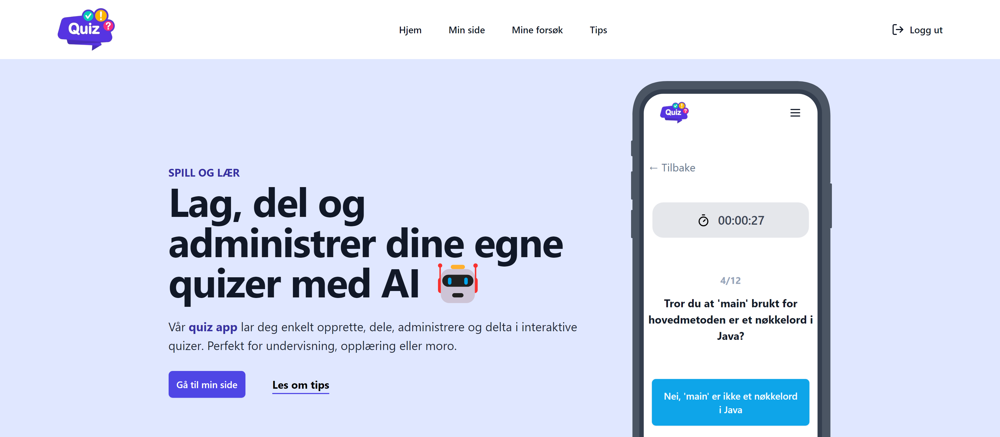

# Quiz App

</img>

This repository contains a React frontend application that lets you create quizzes with the help of ChatGPT. The app allows you to create, share and edit quizzes.

View the site at ...

View the backend at https://github.com/JonathanD01/quiz-app-backend

## Features
- Create, share and edit your own quizzes with ai
- Navigate through your quizzes
- See how well you did on a quiz

## Build
1. Clone the repository
2. Navigate to the project directory
3. Build project with `docker-compose up --build` & access page on `http://localhost`

## Dependencies
- Docker
